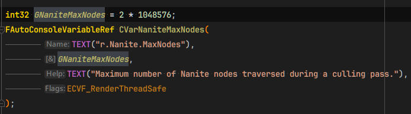
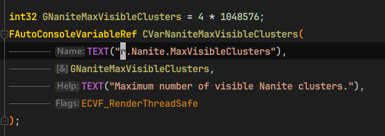
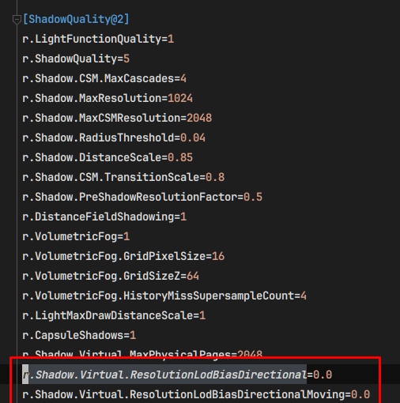
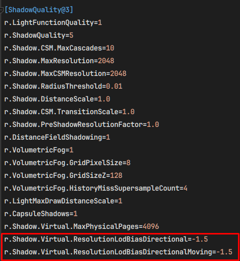

# Getting 4M hay pieces to 60+ FPS

How the Haystack pile went from ~2 FPS to 60+ FPS at 1080p High settings, and which steps moved the number.

All numbers measured on my dev PC with Ryzen 9 5950x paired with RTX 3070Ti.

Development is done in UE 5.8, keeping the stock High scalability settings, TSR at native (100%) screen percentage and no DLSS.

The delivery target was 60+ FPS on Ryzen 7 7800X3D paired with RTX 5060. Since my dev PC isn't exactly the same, I aim to have at least 75+ FPS for margin.

# The setup

The brief asks for:
- 4M hay pieces in a half-dome,
- each one hoverable,
- grabbable and dropabble individually,
- replicated,
- performs at 60+ FPS at High settings

Two decisions came before any measurement, one is that I've used my personal template project based on https://github.com/daftsoftware/StarterProject/tree/5.7-mobile converted to a BP-only project and updated to 5.8 with a Third Person Template set up inside. At a glance it uses a mobile-forward preset:
- DX11,
- SM5,
- ES3.1 preview,
- Nanite off,
- VSM off,
- FXAA instead of TSR

Since the brief asks for "Unreal High Graphic", it should expect at least:
- Stock desktop renderer,
- Nanite on, which needs DX12 and SM6
- VSM on
- Lumen on

So my first change was to revert to the stock config.

The second was to build with no actors at all. 4M `AActor`s instances cost several GB and minutes of spawn time. The plie is chunked as ISM via `UInstancedStaticMeshComponent` components instead, 65,536 instances each with every piece transform a pure function of `hash(Seed, PieceIdx)`, so nothing per piece is stored or replicated and deterministic. Wtih 4M instances into ISM chunks of 65,536 pieces each, we're looking at `4,000,000 / 65,536 = 61.03` chunks, plus the last 2,304 pieces, making it 62 chunks in total.

Transform generation then runs in `ParallelFor` to make use of multithreading and `Tick` adds chunks until ~6ms budget is spent, it then resumes the next frame, which is what keeps the spawn from freezing the game thread.

Mesh: `SM_Hay`, a 40x2.5x1cm slab, 12 triangles and 24 vertices.

Every piece is one Nanite cluster, so 4M pieces exceed the default budgets of 2M nodes and 4M visible clusters.



Therefore I increased the CVar values for `r.Nanite.MaxNodes` and `r.Nanite.MaxVisibleClusters` to `8388608` in `Config/DefaultEngine.ini`.

# Run 1

First measurement, everything stock and on:

```
2-4 FPS

GPU 250ms to 2s per frame while spawning steady state:
Render thread -> 630ms
GPU -> 650ms

Process memory: +21GB
One GPU crash (how fun!)
```
650ms of GPU against an at least 16.6ms budget is ~39x over. At this point the question was whether the design could work at all.

# Run 2

Hay is excluded from the Lumen scene and from distance fields, in theory that 4M mesh cards is an absurd thing to ask of a surface cache. Result:

```
GPU 620ms

Process memory: +18.7GB
```

It barely moved, so I set up so that once spawning completes, `profilegpu` and `memreport` is fired automatically. It then named the cost immediately:

```
Shadow.Virtual.VisibleInstances -> 18 buffers, 12,101MB
total non-transient GPU memoery -> 14,144MB
Nanite (all 24 entries) -> 530MB
Lumen (all 84 entries) -> 404MB
```

# Run 3

From the `profilegpu` and `memreport` result obtained earlier, Virtual Shadow Maps held ~86% of GPU memory in per-instance visibility lists, so this run I turned VSM off entirely:

```
spawn 2.6s, process memory +1GB, GPU 66ms steady
```

Although it's ~10x better now, it's still ~4x over the budget. The useful part was in the GPU profile rather than the frame time. The hay was rasterizing through the non-Nanite path, even though the mesh had Nanite data built.

# "Doctors hate him! Here's how two checkboxes 'fixes' the GPU bottleneck!"

So the material for Hay (`MI_Hay`) inherits from a Quixel material, `M_MS_Srf`, and that material was missing two usage flags:
- `Used with Nanite`,
- `Used with Instanced Static Meshes`

Inside the editor, I found that those flags get set on demand the first time something needs them, which is why the pile looked fine in the viewport.

Outside the editor, nothing sets them, so the engine substituted the default material and dropped every piece onto the non-Nanite instanced path with no error in the log.

VSM then did what it has to do for 4M non-Nanite instances: build per-light and per-page visible instance lists. That is the 12GB from the Run 2's profiling result.

Two other settings done on this pass:
- Static ISM chunks refuse to attach to a `Movable` root, so all 62 chunks stayed at world origin instead of the following the actor. The pile root is `Static` now,
- hay in the Lumen scene -> 4M mesh cards. Chunks keep `bAffectDynamicIndirectLighting` and `bAffectDistanceFieldLighting` off and still receive GI.

A new run with same scene, settings, VSM and Lumen back on:

```
spawn 1.9s, process memory +1.1GB, GPU non-transient 2.0GB
1080p: 80-100 FPS, GPu 8-11.5ms
1440p: 58-60 FPS, GPU 15-16ms
```

GPU went from 650ms -> 11.5ms max at 1080p. The largest win in the whole effort was that two material checkboxes, and the pass breakdown at 11.5ms finally looked like a 'normal' frametimes:

| Pass | ms |
| --- | --- |
| Nanite visibility | 2.9 |
| VSM via Nanite | 2.2 |
| TSR | 1.4 |
| Sky atmosphere | 1.2 |
| Lighting | 1.0 |

# Second pass: stop paying for the buried hay to optimize spawning times

With raster fixed, the remaining cost was the bookkeeping rather than drawing the triangles. 

The reason turns out was chunk bounds. Each of the 62 chunks held instances spread across the entire dome, so each chunk's bounds were the whole dome, so every frame tested **all** 4M instances against the frustum and the Hierarchical Z-Buffer (HZB).

Nanite's occlusion culling keeps the interior of the dome being rasterized. It does not keep those instances from being tested though, and CPU-side frustum culling has nothing to work with when every component covers the whole object.

Two changes because of this:

1. Spherical cells, the hemisphere is now cut into 40 radial shells 20cm thick, and each shell into equal-volume cells holding ~32k pieces each
2. Only spawn the visible shells, A `RevealBelow(PieceIdx)` function was introduced and it queues the cells under a removed piece, so digging never opens a gap into empty space. Sight into the pile stops after ~15cm at this density, so 20cm shells read as 'solid' from the outside and therefore used as `ShellThickness` value.

Plus two config lines under `[ShadowQuality@2]` in `Config/DefaultScalability.ini`:
- `r.Shadow.Virtual.ResolutionLodBiasDirectional=1.0`
- `r.Shadow.Virtual.ResolutionLodBiasDirectionalMoving=1.0` 

High defaults to `0.0` in Engine's `BaseScalability.ini`


and Epic quality uses `-1.5`, 



so this halves directional shadow texel density for a slightly softer shadows. Resulting in:

```
570,500 pieces in 18 of 133 cells
spawn 0.42-0.83s, process memory +427MB
GPU 7.4-9.6ms, 92-102 FPS at 1080p
```

# The arc in one table

|                   | Run 1        | Lumen off | VSM off      | Flags fixed | Shell cells |
| ----------------- | ------------ | --------- | ------------ | ----------- | ----------- |
| Pieces resident   | 4,000,000    | 4,000,000 | 4,000,000    | 4,000,000   | 570,500     |
| FPS               | 2-4          | 2-4       | ~15          | 80-100      | 92-102      |
| GPU per frame     | 650ms        | 620ms     | 66ms         | 8-11.5 ms   | 7.4-9.6 ms  |
| Process memory    | +21GB        | +18.7GB   | +1GB         | +1.1GB      | +472MB      |
| GPU non-transient | not captured | 14.1GB    | not captured | 2.0GB       | 2.0GB       |
| Spawn time        | 60s          | 28s       | 2.6s         | 1.9s        | 0.4-0.8s    |


# Where the number stands now

Measured by the Gauntlet perf test (`Scripts/RunGauntletPerf.ps1`): 
- One client stands at the pile for 60s after a 5s warmup,
- staged builds from the source engine,
- windowed

The captures, summaries and PerfReportTool report are available in `Saved/Results/HayPerf_20260912_022047`. I also tested it in multiple resolution from 1080p, 1440p and my native display resolution, 3840x2560.

| Build       | Resolution | Frame avg | p99   | FPS   | GPU     | Game thread | Memory |
| ----------- | ---------- | --------- | ----- | ----- | ------- | ----------- | ------ |
| Development | 1920x1080  | 9.64ms    | 13.01 | 103.8 | 8.82ms  | 2.05ms      | 1741MB |
| Development | 2560x1440  | 14.53ms   | 17.06 | 68.8  | 13.72ms | 1.97ms      | 1777MB |
| Development | 3840x2560  | 33.43ms   | 42.31 | 29.9  | 32.61ms | 2.16ms      | 1777MB |
| Shipping    | 1920x1080  | 8.97ms    | 10.43 | 111.5 | 8.31ms  | 1.00ms      | 1713MB |
| Shipping    | 2560x1440  | 14.18ms   | 16.60 | 70.5  | 13.55ms | 1.06ms      | 1701MB |
| Shipping    | 3840x2560  | 33.21ms   | 37.87 | 30.1  | 32.53ms | 1.09ms      | 1697MB |

Can be concluded that it's GPU bound at every resolution, and the cost scales with pixels:
- 1080p -> 9ms,
- 1440p -> 14ms,
- 3840x2560 -> 33ms

Shipping saves about 1ms of game thread, and 40MB of memory. The GPU is within 5% margin compared to Development config.


# Key takeaways

1. Verify the render path before optimizing anything on it. The ~56x win was two material usage flags. Counting how many chunks report Nanite is one line of logging, and it would have found the problem quicker instead of hours like I did.
2. Nanite occlusion culling saves raster, but not per-instance work. Tight component bounds are what save per-instance work, and one component spanning the whole object has no bounds worth culling against.
3. The cheapest instance, is the one that does not exist. Shells cut resident instances with no visible difference from the outside.
4. Measure by subtraction and then automate the dump. Lumen off, then VSM off, one CVars at a time, with `profilegpu` and `memreport` proven to be the most helpful tool for this.
5. Memory was the tell. 21GB of process growth says something is per-instance and does not know about it. The frame time also said the pile was too slow, and the memory report said which system it was spending most time on.
